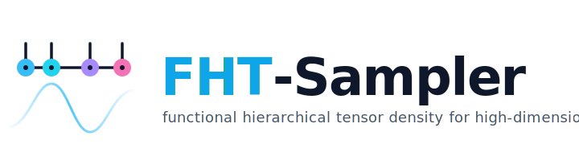

<p align="center">
  
</p>

# FHT-Sampler

Reference implementation, input templates, and analysis notebooks for

> **High-Dimensional Enhanced Sampling via Regularized Path-Dependent
> McKean–Vlasov Dynamics using Tensor Density Approximation.**
> Liyao Lyu, Siyu Guo, Huan Lei. *Preprint, 2026.*

**FHT-Sampler** is an adaptive-biasing scheme for sampling high-dimensional
Gibbs measures with rugged free-energy landscapes. It approximates the
collective-variable (CV) marginal density using a **functional hierarchical
tensor (FHT)** representation, and drives the dynamics with a **regularized,
path-dependent McKean–Vlasov drift** built from a history-weighted measure.
The combination is optimization-free, finite-walker stable, and demonstrated
on CV spaces of dimension up to 64.

The method is implemented as a custom collective variable on top of
[PLUMED](https://www.plumed.org/) and run with
[GROMACS](https://www.gromacs.org/). This repository collects everything
needed to read, understand, and reproduce the paper's figures across a range
of benchmarks — from a 2D toy potential to small peptides and folded
mini-proteins.

## What's in here

The custom PLUMED action lives in each system's `template/MetaTensor.cpp`
(legacy filename — registers the FHT-Sampler bias inside PLUMED), together
with the matching `plumed_*.dat` input files and a `sketching.py` helper
that constructs the FHT density sketch. Per-system driver scripts
(`sequence`, `sequence_rerun`, `collect_data`) wrap the GROMACS + PLUMED
runs and post-processing.

### Benchmark systems

| Directory          | System                              | Notes                                    |
|--------------------|-------------------------------------|------------------------------------------|
| `muller/`          | Müller–Brown 2D potential           | Toy benchmark, Langevin dynamics         |
| `ala2_gaussian/`   | Alanine dipeptide (Ala₂)            | Standard φ/ψ benchmark                   |
| `ala4_gaussian/`   | Alanine tetrapeptide (Ala₄)         | Higher-dimensional dihedral landscape    |
| `chi.1/`, `chi.3/` | χ-angle benchmarks                  | Side-chain rotamer sampling              |
| `1UAO_3/`          | Chignolin (PDB 1UAO)                | 10-residue β-hairpin, folding benchmark  |
| `1VII2/`           | Villin headpiece (PDB 1VII)         | 36-residue helical mini-protein          |
| `result/`          | Aggregated paper figures & scripts  | Cross-system summary plots               |

Each `case*/` subfolder is a separate run configuration (different
hyperparameters, CV definitions, or seeds). The naming is roughly
chronological and is preserved so that figure scripts and notebooks resolve
without renaming.

## Repository layout

A typical system folder looks like:

```
<system>/
├── case<N>/
│   ├── config.py            # Run hyperparameters
│   ├── template/
│   │   ├── MetaTensor.cpp   # PLUMED CV implementation
│   │   ├── plumed_init.dat  # Equilibration / unbiased run
│   │   ├── plumed_tensor.dat# Biased run with MetaTensor CV
│   │   ├── sketching.py     # Tensor-sketch construction
│   │   └── *.pdb / *.gro / *.mdp / *.top / *.ndx
│   ├── sequence             # Driver script (launches a run set)
│   ├── sequence_rerun       # Reweighting / rerun driver
│   ├── collect_data         # Post-processing: gather COLVAR / FES
│   └── figure.ipynb         # Per-case analysis notebook
└── compare/                 # Cross-case comparison inputs and notebooks
```

## Reproducing the figures

The fastest way to see how a result is produced end-to-end is:

1. Pick a system (e.g. `muller/` or `ala2_gaussian/case7/`).
2. Read `config.py` for the hyperparameters used in the paper.
3. Read `template/plumed_tensor.dat` and `template/MetaTensor.cpp` for the
   CV definition.
4. Run the system through `sequence` → `collect_data` to generate COLVAR
   files and free-energy estimates.
5. Open `figure.ipynb` (or the relevant notebook in `result/`) to render the
   plots.

Compiling `MetaTensor.cpp` requires a PLUMED build with the C++ developer
headers; see the PLUMED docs on
[adding a new CV](https://www.plumed.org/doc-master/developer-doc/html/_how_to_add_a_c_v.html).

## What's *not* in this repo

This repository is a **curated subset**: it ships the source, inputs, and
analysis required to read and rebuild the work, but not the bulk simulation
output. The following are intentionally omitted (and listed in
`.gitignore`):

- GROMACS / PLUMED trajectories and checkpoints — `*.xtc`, `*.trr`,
  `*.edr`, `*.tpr`, `*.cpt`
- Parallel sampling directories — `run*/`, `w*/`, `sim_*/`
- Aggregated COLVAR dumps and large arrays — `ALL_COLVAR*`, `COLVAR*`,
  `results.npz`, `unbiased_traj.npz`
- Build artifacts and caches — `*.o`, `*.so`, `__pycache__/`,
  `.ipynb_checkpoints/`

Some notebooks therefore reference data files that are not tracked here.
Re-running the pipeline regenerates them; if you want the raw trajectories
without re-running, please contact the authors.

## Dependencies

**Core**

- Python ≥ 3.9 with `numpy`, `scipy`, `matplotlib`, `pillow`, `jupyter`
- [GROMACS](https://www.gromacs.org/) (tested with 2022.x)
- [PLUMED](https://www.plumed.org/) (tested with 2.9.x), patched against
  GROMACS and built with `MetaTensor.cpp` registered as a custom CV

**Optional, used only by some figure scripts**

- [PyMOL](https://pymol.org/) — molecular renders
- LaTeX — math typesetting in the paper figures

## Citation

A preprint describing the method is in preparation; if you use this code,
please cite it as:

```bibtex
@unpublished{LyuGuoLei2026FHTSampler,
  author = {Lyu, Liyao and Guo, Siyu and Lei, Huan},
  title  = {High-Dimensional Enhanced Sampling via Regularized
            Path-Dependent McKean--Vlasov Dynamics using Tensor
            Density Approximation},
  note   = {Preprint, 2026},
  year   = {2026}
}
```

*(This entry will be updated with arXiv ID / DOI once the preprint is
posted, and replaced with an `@article` entry on publication.)*

## License

Released under the [Apache License 2.0](LICENSE).
Copyright © 2026 Liyao Lyu, Siyu Guo, Huan Lei.

## Contact

Questions, bug reports, and collaboration inquiries are welcome via GitHub
Issues, or by email to the corresponding author of the paper.
